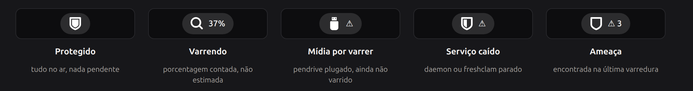
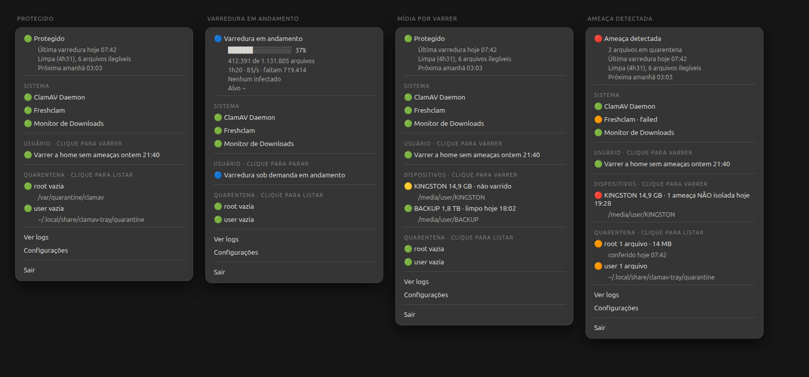

# clamav-tray

Indicador de bandeja para uma instalação de ClamAV gerenciada por **systemd**.
Responde, sem abrir terminal: *os serviços estão de pé, tem varredura rodando
agora, e como terminou a última?*



Um clique abre o estado completo — serviços, varredura, mídia removível e
quarentena:



> As imagens são renderizações fiéis, montadas a partir da estrutura que o
> próprio programa produz, com os SVGs do tema Adwaita. Os ícones aparecem
> **brancos** porque é assim que são de fato: o indicador pede um ícone pelo
> nome (`security-high-symbolic`) e quem pinta é o shell, com a cor de primeiro
> plano do painel — o que distingue um estado do outro é a forma e o rótulo ao
> lado, não a cor. A primeira faixa é regenerável com
> `python3 docs/screenshots/make-tray-states.py`.

## Por que existe

O [ClamTk](https://github.com/dave-theunsub/clamtk) é a referência da categoria
(436★), mas é um scanner sob demanda: **zero** referências a systemd, **zero** a
bandeja, e o último *push* de código foi em março de 2024. Os demais projetos da
busca têm 0 ou 1 estrela.

Ninguém preencheu o espaço de *"meu ClamAV já roda por systemd, quero ver o
estado dele"*.

**Requer systemd.** É a premissa, não uma limitação temporária — o valor do
projeto é justamente ler o estado das unidades.

## Instalação

```sh
pipx install clamav-tray     # ainda não publicado — por ora: clone e `pipx install .`
```

**Dependências de sistema:** `python3-gi`, GTK 3 e um dos dois AppIndicator
(`gir1.2-appindicator3-0.1` ou `gir1.2-ayatanaappindicator3-0.1` — o programa
tenta os dois).

### Subir sozinho no login

```sh
./packaging/install-autostart.sh          # serviço de usuário, supervisionado
./packaging/install-autostart.sh xdg      # autostart XDG, sem supervisão
```

Nenhum dos dois precisa de root. Prefira o primeiro: se o processo morrer, ele
volta, e o journal guarda o motivo. O autostart XDG dispara e esquece — foi assim
que o indicador que deu origem a este projeto sumiu da bandeja sem deixar rastro.

O instalador funciona **antes** de `pipx install`: sem o `clamav-tray` no PATH,
ele aponta a unidade para o código no diretório atual. E confere se o serviço
subiu — não afirma "ativado" sem olhar.

### Bandeja no seu desktop

| Desktop | Situação |
|---|---|
| KDE, XFCE, Cinnamon, MATE | nativo |
| Ubuntu | funciona (a Canonical embarca `ubuntu-appindicators`) |
| GNOME puro | **precisa de extensão** — o GNOME removeu a bandeja na 3.26 |

## O que funciona numa instalação limpa

O programa **observa** o que existe. Não instala unidade, não agenda varredura e
não decide o que varrer — é essa escolha que o mantém instalável sem root.

| | De fábrica |
|---|---|
| ClamAV Daemon, Freshclam, On-Access | **sim**, vêm nos pacotes |
| Varrer a home, varrer mídia removível | **sim**, precisa só do `clamd` no ar |
| Quarentena do usuário, barra de progresso | **sim** |
| Varredura agendada, "Próxima", "Última" | **não** — nenhuma distro entrega |
| Monitor de pasta, quarentena do sistema | **não** |

Metade de cima funciona; a metade da varredura nasce vazia. Não é bug: a distro
não agenda varredura, e o programa não deve inventar uma.

Para preencher, há extras **opcionais e independentes** em
[`contrib/extras/`](contrib/extras) — varredura diária, monitor de Downloads,
varredura de USB e publicação das estatísticas de quarentena. Cada um com
instalador próprio, que recusa sobrescrever e diz como desinstalar.

## Configuração

Há um item **Configurações** no menu: ele cria o arquivo comentado se não existir
e abre no seu editor. O arquivo é **relido sozinho ao salvar**.

Nada é obrigatório — o programa descobre as unidades pelo glob `clam*` e os
caminhos pelo `clamconf`.

## Idioma

**Inglês é o padrão e a fonte.** Traduzir é opcional por construção: chave sem
tradução aparece em inglês em vez de quebrar.

```toml
[general]
language = "pt_BR"   # ou "auto" para seguir o locale
```

Para contribuir com um idioma, copie o bloco `pt_BR` em
[`clamav_tray/i18n.py`](clamav_tray/i18n.py) e traduza — sem instalar ferramenta
nenhuma. Não usa gettext de propósito; o porquê está em
[docs/design.md](docs/design.md).

## Documentação

| | |
|---|---|
| [docs/design.md](docs/design.md) | decisões de desenho e o que elas custaram |
| [docs/dbusmenu.md](docs/dbusmenu.md) | o que atravessa o protocolo do menu, e o que não |
| [docs/quarantine.md](docs/quarantine.md) | as duas quarentenas e a convenção de estatísticas |
| [docs/progress.md](docs/progress.md) | progresso por contagem, não por relógio |
| [docs/removable-media.md](docs/removable-media.md) | detecção sem subprocesso |
| [ROADMAP.md](ROADMAP.md) | o produto, e a migração para Rust |
| [CONTRIBUTING.md](CONTRIBUTING.md) | como contribuir |

---

## Este projeto é também meu caderno de Rust

Decidi usar este projeto para **aprender Rust**, migrando **um módulo por vez**
até que não sobre Python.

- A migração acontece em **branch separada** (`rust`), nunca na `main`
- A `main` continua sendo a versão Python, funcional e mantida
- A **virada de chave só acontece quando eu tiver confiança na linguagem** — não
  por prazo, não por metade dos módulos portados. Se essa confiança não vier, a
  versão Python permanece e isso não é fracasso
- Quem instala usa Python e não precisa saber de nada disso

O desenho em módulos existe por causa disso: cada arquivo tem uma fronteira clara
e pode ser portado sozinho. A ordem e o critério estão no [ROADMAP](ROADMAP.md).

**Se você é contribuidor:** mande PR contra a `main`, em Python. A branch `rust`
é exercício pessoal e pode ser reescrita à força a qualquer momento.

## Estado

v0.1, em uso diário por uma pessoa. Publicado porque o nicho estava vazio, não
porque seja maduro. Se você usar, espere arestas — e abra issue.

## Licença

MIT.
